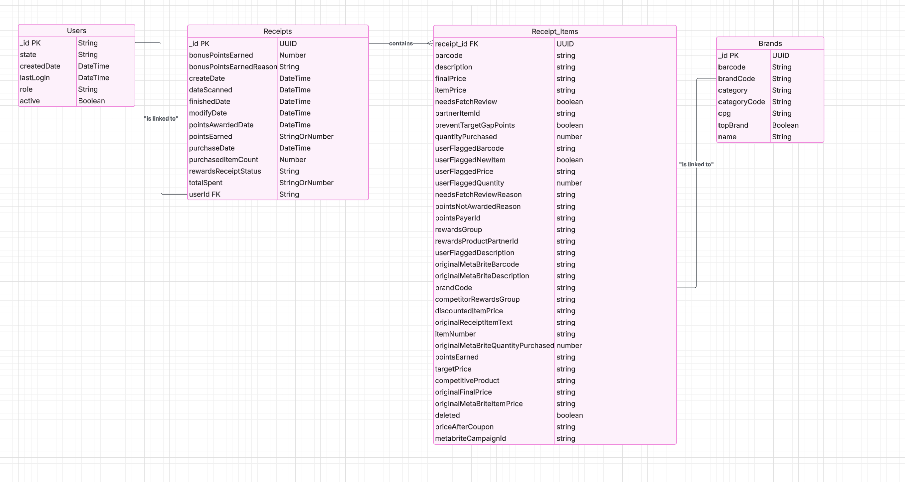

# A Few Notes Before Digging In....
- **Normally I would make issues, branches from those issues and PR's from those branches, but for the sake of this just being a test I did not, I'm also commiting directly to main, and I am commiting Snowflake Creds to the repo.... I am literally breaking every single un-written rule in the book LOL, please know that I am away and only doing it because this is just a test :)**
- All of these Python scripts are runnable using Python 3.10.8. Please create a virtual environment and run `pip install -r requirements.txt` before executing.
- All Python scripts have been formatted with Black, and all SQL code has been formatted with sqlfmt. I am familiar with having CI/CD processes handle this, but did it manually for this project.
- I am using the Snowflake SQL dialect for all SQL queries. You can log in and run the SQL in the Snowflake trial org I have created, with the following details (if the trial is still active):
  - **Account:** `ya59647.us-east-2`
  - **User:** `BWELLSDATACOWBOY`
  - **Authenticator:** `snowflake`
  - **Password:** `1*oMCNUc$Fcz%Kf`

# First Review Existing Unstructured Data and Diagram a New Structured Relational Data Model

In this phase, I explored the raw data provided in the JSON files and developed a structured relational data model for the data warehouse. Below is an overview of the process:

1. **Initial Data Exploration:**  
   I began by running the script `python/1_try_json.py`, which attempted to load each JSON file (brands, receipts, and users) using Python's `json.load()`. This script failed on all three files, confirming that the data was unstructured.

2. **Fixing the JSON Structure:**  
   After reviewing the error messages and examining the raw JSON files, I noticed that they lacked a parent array or dictionary by manually looking at the raw JSON in VSCode; the JSON objects were simply listed one after another without proper delimiters. To resolve this, I created a second script, `python_scripts/2_add_json_proper_format.py`, which uses a regex to insert commas between adjacent JSON objects and wraps the content in square brackets. This converts the data into a valid JSON array.

3. **Inspecting the Data Structure:**  
   With the data properly formatted, I ran a third script, `python_scripts/3_print_json_keys.py`. This script loads the formatted JSON and prints a hierarchical tree of keys along with their data types (e.g., dict or list). Through this inspection, I discovered that many keys were missing from the provided requirments (specifically Receipt Items), and I identified the need for an additional object to capture the receipt items.

4. **ERD Diagram:**  
   Based on these insights, I modeled a new structured relational data model. The new model includes separate entities for Receipts, Users, Brands, and a new Receipt_Items entity to capture the nested receipt item details.  
   
   
   

This process allowed me to understand the underlying data structure and informed the design of the new relational model for our data warehouse. I was also able to intuitively identify where foreign and primary keys were and start connecting the entities.

# Second Write Queries that Directly Answer Predetermined Business Questions

I attempted to answer all the business questions using SQL queries against our structured relational data model. The questions were:

- **What are the top 5 brands by receipts scanned for the most recent month?**
  - unanswered
- **How does the ranking of the top 5 brands by receipts scanned for the recent month compare to the ranking for the previous month?**
  - unanswered
- **When considering average spend from receipts with 'rewardsReceiptStatus' of 'Accepted' or 'Rejected', which is greater?**
  - See the full query in `sql/mart/mart_brand_receipt_comparison.sql`.
- **When considering total number of items purchased from receipts with 'rewardsReceiptStatus' of 'Accepted' or 'Rejected', which is greater?**
  - See the full query in `sql/mart/mart_brand_receipt_comparison.sql`.

- **Which brand has the most spend among users who were created within the past 6 months?**
  - See the full query in `sql/mart/mart_top_brands_six_months.sql`.

- **Which brand has the most transactions among users who were created within the past 6 months?**
  - See the full query in `sql/mart/mart_top_brands_six_months.sql`.

### Observations and Data Quality Issues while creating business models

- **Limited Data in the BrandCode Field:**  
  The join between receipt items and brands is based on the `brandCode` field. However, many receipt items lack a valid `brandCode`, so the analysis for the top 5 brands and their ranking (first two questions) has limited accuracy. I decided to toss out this query as only 2 business questions needed answered.

- **Status Values Issue:**  
  In our receipts data, the `rewardsReceiptStatus` field does not contain the expected 'ACCEPTED' value; only 'REJECTED' and 'FINISHED' are present. Therefore, for status-based analyses, the query uses 'FINISHED' in place of 'ACCEPTED'. This is a data quality issue that affects the comparison of average spend and total items purchased.

- **Limited Historical Data:**  
  The receipt data only goes back to March 2021 (in fact, starting March 3rd, 2021). This greatly limits the analysis for questions regarding users created in the past 6 months and makes it difficult to fully address the last two business questions.


# Third Evaluate Data Quality Issues in the Data Provided

In our data exploration (see `sql/data_exploration.sql` for full queries), we identified several key data quality issues:

- **Unreliable Join on BrandCode:**  
  The only available join between receipt items and brands is via the `brandCode` field. An example query shows:
  
    ```sql
  select count(*) as total_receipt_items,  
         sum(case when b.brand_id is null then 1 else 0 end) as unmatched_receipt_items,  
         sum(case when b.brand_id is not null then 1 else 0 end) as matched_receipt_items  
  from stg_receipt_items_flat ri  
  left join stg_brands_flat b on ri.brandCode = b.brand_code;
  ```
  
  **Results:**  
  TOTAL_RECEIPT_ITEMS = 6947, UNMATCHED_RECEIPT_ITEMS = 6312, MATCHED_RECEIPT_ITEMS = 635  
  
  This indicates that most receipt items do not have a valid `brandCode`, making the join unreliable.

- **Limited Historical Data:**  
  The query below shows that the earliest receipt date is from October 30, 2020, with the majority of data concentrated around March 2021:
  
    ```sql
  select min(createDate) as earliest_receipt_date, max(createDate) as latest_receipt_date  
  from stg_receipts_flat;
  ```
  
  This limitation impacts our ability to perform analyses that require six-month historical data.

- **Missing 'ACCEPTED' Status Value:**  
  A query listing distinct values in `rewardsReceiptStatus` reveals the following:
  
    ```sql
  select distinct rewardsReceiptStatus  
  from stg_receipts_flat;
  ```
  
  **Results:**  
  FINISHED, REJECTED, FLAGGED, PENDING, SUBMITTED  
  The expected status 'ACCEPTED' is missing, which affects analyses comparing spend or item count between statuses.

- **Inconsistent or Missing Brand Codes in Brands Table:**  
  A query checking for key consistency in the Brands table shows many occurrences of test brand codes and several null or empty values:
  
    ```sql
  select brand_code, count(*) as occurrences  
  from stg_brands_flat  
  group by brand_code  
  order by occurrences desc;
  ```
  
  This inconsistency further complicates reliable joins between receipt items and brands.

- **Purchased Item Count Issues:**  
  There are many receipts with a null value for `purchasedItemCount`, which could distort any analysis on total items purchased. For example:
  
  ```sql
  select purchasedItemCount, count(*) as frequency  
  from stg_receipts_flat  
  group by purchasedItemCount  
  order by frequency desc;
  ```

These observations highlight the key data quality challenges we encountered. The full set of queries to validate these issues is included in the `sql/data_exploration.sql` file.


# Fourth Communicate with Stakeholders (email)

Hi Team,

I have completed my initial analysis of the provided data and would like to share some observations, questions, and points for clarification regarding the dataset:


**Questions about the Data:**
- Should the join between receipt items and brands rely solely on the `brandCode` field? Many receipt items have missing or inconsistent `brandCode` values, which raises concerns about the reliability of this key.
- Is there an updated or extended dataset available that covers a longer historical period? Currently, the receipt data only starts from March 2021 (with some records dating back to October 2020), which limits our ability to perform analyses that require a six-month history.
- What are the expected values for the `rewardsReceiptStatus` field? The data only contains values such as 'FINISHED', 'REJECTED', 'FLAGGED', 'PENDING', and 'SUBMITTED', and the expected 'ACCEPTED' status is missing.
- **Cadence and Volumes:**  
  What is the expected cadence for receiving this data? Are updates expected daily, weekly, or monthly? Additionally, can you provide an estimate of the expected data volume (e.g., number of receipts, users, and receipt items per period)?
- **Receipt Items Information:**  
  There is little to no documentation on the receipt items. Is there any additional information available regarding the receipt items’ schema or the business rules associated with these fields?

**How I Discovered the Data Quality Issues:**
- I initially ran a simple Python script to load the JSON files, which failed due to the unstructured nature of the data.
- After inspecting the raw JSON, I noticed that the files lacked a parent array or dictionary. I then developed a script to reformat the data into valid JSON.
- Finally, I ran another script to print the hierarchical keys and their types, which highlighted missing fields and inconsistencies—particularly within receipt items and the status values.
- In addition I was able to test a series of SQL queries that looked at unjoined foreign key value counts, null vlaues and empty strings that further exposed many of these issues.

**What I Need to Resolve the Data Quality Issues:**
- Guidance on the appropriate key to use for joining receipt items to brands. Should we continue relying solely on `brandCode`, or should we consider alternative fields?
- Access to a more complete dataset that covers the full historical range necessary for comprehensive analysis.
- Confirmation on the valid values for `rewardsReceiptStatus` and whether any data corrections or updates are planned for this field.

**Additional Information Needed to Optimize Data Assets:**
- Details on how frequently the raw data is updated (cadence) and any expected data volumes.
- Any available documentation or data dictionaries that detail field definitions and expected value ranges, particularly for receipt items.
- Insight into business rules for handling incomplete or inconsistent fields (e.g., null or test values in `brandCode`).

**Performance and Scaling Concerns:**
- As the volume of data increases, complex joins (especially on unreliable keys) may impact query performance. We may need to consider strategies such as partitioning, indexing, or clustering keys in Snowflake.
- Incremental data processing and automated ETL pipelines will be essential for maintaining performance as the dataset grows.
- Regular monitoring and automated data quality checks will be crucial to quickly identify and resolve any issues.

I look forward to your feedback on these points. Please let me know if you need any further details or if there are any adjustments required in our data processing approach.


Best,
Buzz Wells
